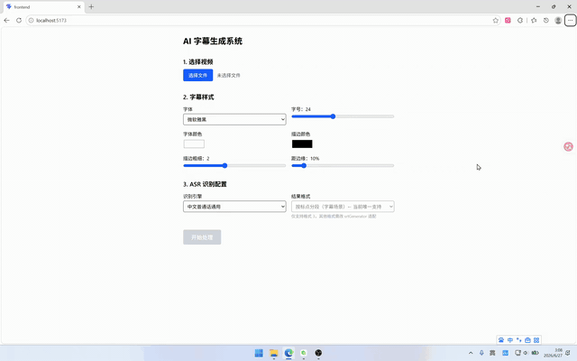

# AI 字幕生成工具

一键完成：视频 → 腾讯云 ASR 识别 → 清洗生成 SRT → FFmpeg 烧录字幕。

支持 CLI 命令行和 Web 界面两种模式。

## 运行环境

| 依赖 | 版本 | 说明 |
|------|------|------|
| Node.js | ≥ 18 | 推荐 LTS |
| FFmpeg | ≥ 5.0 | 需加入系统 PATH |
| 字体 | Microsoft YaHei | 系统自带即可 |

FFmpeg 安装：https://ffmpeg.org/download.html

## 依赖安装

```bash
# 后端依赖
npm install

# 前端依赖（Web 模式才需要）
cd frontend && npm install
```

## 环境变量配置

在项目根目录创建 `.env`：

```env
TENCENTCLOUD_SECRET_ID=你的SecretId
TENCENTCLOUD_SECRET_KEY=你的SecretKey
PORT=3000
```

密钥获取：https://console.cloud.tencent.com/cam/capi

## 一键运行

### CLI 模式

```bash
node backend/main.js <视频路径>

# 示例
node backend/main.js input.mp4
node backend/main.js ./videos/my-video.mp4
```

完成后输出文件在 `backend/storage/output/` 下。

### Web 模式

```bash
# 终端 1：启动后端
npm run dev

# 终端 2：启动前端
cd frontend && npm run dev
```

浏览器打开 http://localhost:5173 ，上传视频 → 配置样式 → 开始处理 → 下载结果。

## 字幕样式设计

CLI 模式使用以下默认值，Web 模式支持在前端界面自定义所有参数：

| 参数 | 默认值 | 可选范围 | 设计理由 |
|------|--------|----------|----------|
| 字体 | Microsoft YaHei | 系统已安装字体 | 系统自带，中文显示清晰，无需额外安装 |
| 字号 | 24px | 12~72px | 适配 1080p 视频，移动端缩放后仍可辨识 |
| 颜色 | 白色 #FFFFFF | 任意颜色 | 通用性最强，搭配黑色描边在任何背景下可读 |
| 描边颜色 | 黑色 #000000 | 任意颜色 | 增强对比度，防止字幕融入亮色背景 |
| 描边粗细 | 2px | 0~5px | 适中描边，不侵蚀文字又保证可读 |
| 对齐方式 | 底部居中 | — | 符合观看习惯，不遮挡画面主体 |
| 距底部 | 10% | 0%~100% | 按百分比适配不同分辨率，避开视频底部 UI |

## 错误处理与日志

**错误处理：**
- 文件格式校验：仅接受 MP4，其他格式直接报错
- API 重试：ASR 识别结果轮询失败时自动重试
- 任务状态追踪：处理失败时返回具体错误信息，前端实时展示

**日志输出：**
- 控制台：实时输出处理进度（提取音频 → ASR 识别 → 生成字幕 → 烧录）
- 文件日志：每个任务生成独立日志文件（`storage/logs/{taskId}.log`），使用 Winston 库，自动标注任务 ID，方便排查问题

## 项目结构

```
AI_subtitle/
├── backend/
│   ├── main.js              # CLI 入口
│   ├── app.js               # Web 后端入口
│   ├── routes/route.js      # API 路由
│   ├── services/            # 核心逻辑
│   │   ├── processVideo.js  # 主流程编排
│   │   ├── ffmpegService.js # FFmpeg 命令封装
│   │   ├── asrService.js    # 腾讯云 ASR 封装
│   │   ├── srtGenerator.js  # ASR 结果清洗 → SRT
│   │   ├── logger.js        # Winston 日志
│   │   └── store.js         # 任务状态存储
│   └── storage/             # 文件存储（自动创建）
├── frontend/                # React + Vite + Tailwind
│   └── src/components/ASRPanel.jsx
├── 记录/                    # 详细开发文档
└── .env                     # 环境变量（不提交）
```

## 详细文档

开发过程记录在 `记录/` 目录下：

| 文档 | 内容 |
|------|------|
| [完整流程设计](记录/3.%20完整流程设计.md) | 系统架构、数据流、异步轮询设计 |
| [实现计划](记录/4.%20实现计划.md) | 四层实现策略与进度 |
| [后端代码说明](记录/7.%20后端%20services%20代码说明.md) | 各 service 函数逐行解析 |
| [前端代码说明](记录/6.%20ASRPanel.jsx%20代码说明.md) | ASRPanel 组件结构与交互逻辑 |

## 已知问题

**竖屏视频字幕位置偏差：**
- 现象：竖屏视频（带 rotation=90/270 元数据）设置 marginV=16% 时，烧录后字幕实际位置约为 60%
- 原因：FFmpeg 的 auto-rotation 在滤镜链之后执行，subtitles 滤镜在原始坐标系中渲染，导致百分比计算基准错误
- 影响范围：仅竖屏视频，横屏视频正常
- 临时方案：竖屏视频建议手动调整 marginV 至较小值（如 5-8%）
- 根本解决：需要重构 FFmpeg 命令流程，先旋转视频再烧字幕，或精确处理旋转后的坐标映射

## 演示



> GIF 展示：上传视频 → 配置样式 → 开始处理 → 下载结果
